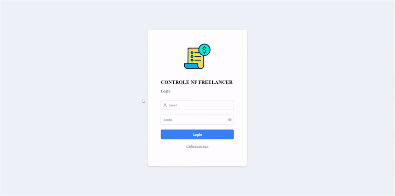

<h1 align="center">Controle de NF Freelancer</h1>

<h2 align="center">Demo</h2>

https://happy-wave-071e44110.3.azurestaticapps.net/auth/login

Email: <strong>srvibbraneo@gmail.com</strong>

Senha: <strong>vibbra@123<strong>

 

---

- ## [Escopo e Estimativas](docs/pages/estimativas.md)
- ## [Detalhes Técnicos e Execução do Projeto](docs/pages/setup.md)

----
 
 

 

Teste de Fullstack Controle de NF Freelancer - Teste técnico Vibbra

