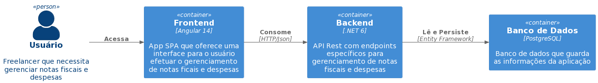

# Detalhes Técnicos e Execução do Projeto

A aplicação é composta por três _Contêineres*_:
- Uma API Rest desenvolvida na stack .NET 6;
- Uma App SPA desenvolvida em Angular 14;
- Um banco de dados PostgreSQL.


<br>

_*Contêineres_ - Seguindo a convenção do padrão _C4 Model_ (https://c4model.com/).
<br>
<br>

----

## Execução do projeto via Docker Compose

Com o docker instalado e configurado ([Instalação Docker](https://docs.docker.com/get-docker/)), o projeto pode ser executado localmente via docker-compose.

## Passos para execução:

1. Acessar a raíz do projeto no terminal;

2. Executar o seguinte comando:
    ```
    docker-compose up -d
    ```

Após executar o comando acima, o site poderá ser acessado em http://localhost:80/ e o swagger da API poderá ser acessado em http://localhost:5000/swagger.
